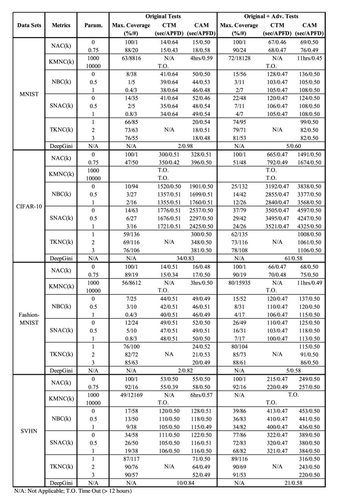

# DeepGini: Prioritizing Massive Tests to Reduce Labeling Cost

---

## Research Background

Deep neural network (DNN) based systems have been deployed to assist various tasks, including many tasks in safety-critical scenarios. In company with the fantastic effectiveness on many tasks, these systems could also exhibit incorrect behaviors and lead to accidents and losses. Therefore, beyond the conventional accuracy-based evaluation, testing techniques that can detect incorrect behaviors in the earlier stage of software lifecycle is also necessary and critical. However, given the fact that automated testing oracle is often not available, testing DNN-based systems usually requires expensive human efforts to label the testing data. In order to reduce the efforts and, meanwhile, diagnose as many fault-inducing tests as possible in a limited time, developers usually want to and an ideal order of tests in which fault-inducing tests are ordered before the others. To this end, we propose DeepGini, a test prioritization technique designed based on a statistical perspective of DNN. Such a statistical perspective allows us to transform the problem of measuring the possibility of misclassifying a test to the problem of measuring set impurity. To evaluate our technique, we conduct an extensive empirical study on four popular datasets. The experiment results show that DeepGini outperforms conventional coverage-based test prioritization in terms of both effectiveness and effciency.

---

## DeepGini: Prioritizing Tests of a DNN

The metric we use to measure the likelihood of misclassifcation is defined as below.

---
## Intuitive understanding of DeepGini

Assume that we have four tests A, B,C, and D as well as a DNN tries to classify them into three classes. The table below shows their output vectors and the values of xi.

According to the values of xi, we can prioritize the tests as D,A,C, and B. D has the highest probability to be misclassified because the DNN outputs the most similar probabilities for each of the three classes. In comparison, for B and C, the DNN is more confident about their classes as B has the probability of 0.8 to be classified into the third class and C has the probability of 0.6 to be classified into the first class.

---

## Use DeepGini for test sample sorting

We use the coverage of [DeepGauge](https://deepgauge.github.io) as the baseline for our experiment. In the experiment we used CAM, CTM as the sorting criterion. We use APFD to evaluate the effect of test sample ordering. The formula for calculating APFD is as follows:

The dataset and deep learning model we use are as follows:

---

## Experimental comparison result

---
